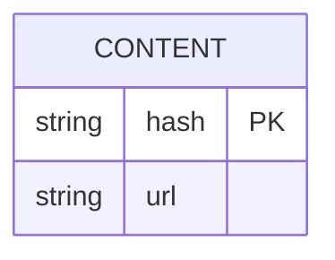

# API
## Barebones
/check

/upload


# Domain modeling

- Content: hash, URL
- Archive: A users private collection of media
- User: A person.
- Post: A collection of media shared from the Users archive.

See http://mermaid.js.org/syntax/entityRelationshipDiagram.html


# User Stories?

See http://mermaid.js.org/syntax/userJourney.html
```mermaid

```
