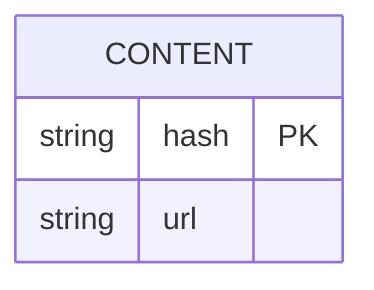

# API
## Barebones

### Check endpoint
Purpose: Check what media has already been uploaded to the service to prevent
unnecessary work.

Returns the list of hashes that the service doesn't know about.

```http
POST /check
Accept: application/json
Content-Type: application/json
Authorization:
["sha256-qvuiqsi", "sha256-nmqur", "sha256-u34i23i"]

200
["sha256-qvuiqsi"]

404
Authentication failure

401
If the body is not an array of strings.
```

Notes: Its ok that this endpoint leaks information about whether another user
has uploaded the photo as the user base is meant to be small and a trusted
community. Requiring authentication should be enough to cover our bases.

TODO: Does this endpoint even makes sense? The user still needs to prove they
own the media for it appear on their archive.

### Upload endpoint
Purpose:
```http
POST /upload
```

Notes:

# Domain modeling

- Content: hash, URL
- Archive: A users private collection of media
- User: A person.
- Post: A collection of media shared from the Users archive.

See http://mermaid.js.org/syntax/entityRelationshipDiagram.html


# User Stories?

See http://mermaid.js.org/syntax/userJourney.html
```mermaid

```
